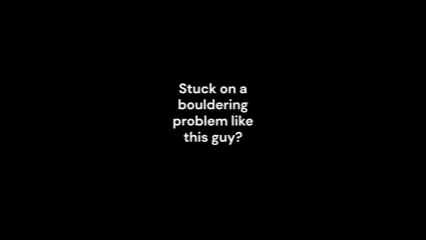

# FermatsBeta

---

## Demo

---

## What is FermatsBeta?

FermatsBeta is an intelligent climbing beta generator that uses an **A\*** search algorithm to simulate and generate optimal sequences for bouldering problems. It's designed to help climbers and route setters visualize efficient moves based on reach, hold positions, and wall scaling.

The name is inspired by **Fermat’s Principle** in physics — the idea that nature follows the most efficient path. This app applies that philosophy to indoor climbing.

---

## Features (v1)

- **Manual Hold Marking**  
  Users manually select hold positions on an uploaded image of a bouldering wall.

- **Pixel-to-Centimeter Scaling**  
  To estimate real-world distances, the user can:
  - Place a reference object (e.g., A4 paper = 21 cm) on the wall.
  - Measure its length in pixels via the app.
  - Let the app scale all hold coordinates accordingly.

- **A\* Search Algorithm**  
  Finds the most efficient path from the starting holds to the finish hold(s), respecting climber reach and physical constraints like:
  - Feet stay below hands
  - No unnatural limb crossover

- **PDF Report Generation**  
  Generates a PDF slideshow showing step-by-step joint positions and movement descriptions.

---

## Tech Stack

- **Frontend**: React Native (with Expo)  
- **Backend**: Flask (Python)  
- **Image Processing & PDF**: PIL (Python Imaging Library)  
- **Pathfinding**: A* algorithm (custom implementation)  

---

## Future Plans

- **Computer Vision**  
  Automatically detect climbing holds from wall images using image recognition and ML models.

- **Lidar Integration**  
  Use depth sensors or Lidar to automate pixel-to-centimeter scaling, eliminating the need for manual measurement.

- **Better Pathfinding**  
  Replace A* with a more nuanced strategy (e.g., reinforcement learning or movement-based heuristics) that accounts for body mechanics, energy use, and route complexity.

- **Web Interface**  
  Allow hold input, beta generation, and visualization directly from a web browser and mobile app.

---
